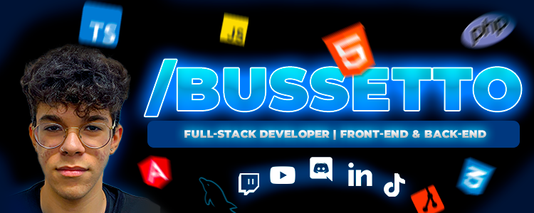
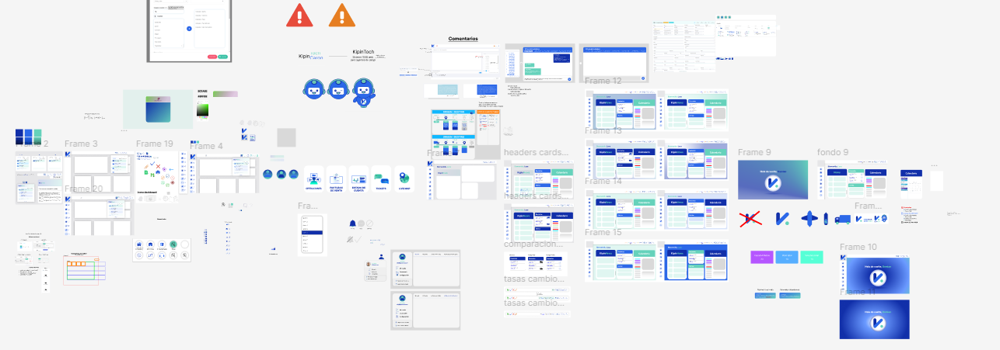
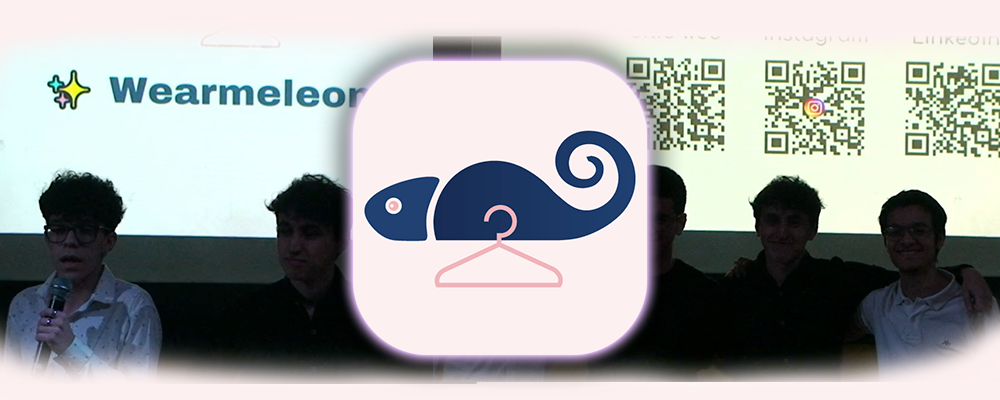

### Semi Senior Web Systems Developer | Front-End & Back-End

  
   
     

     
  
  
  
  
        
  

  <h1 align="center" >¡Hola 👋! Soy Bussetto 👨🏻‍💻</h3>

Soy un apasionado desarrollador de software y sistemas, con 20 años y un camino recorrido en el mundo de la programación desde los 15. 

Durante este tiempo, he trabajado en diversos proyectos, tanto como Front-end Developer como Back-end Developer, lo que me ha permitido desarrollar una visión integral en el desarrollo de aplicaciones modernas. 💻

## 🚀 Habilidades y Tecnologías

Front-end: ⚛️Angular, #️⃣TypeScript, </> HTML5, 🎨CSS3, ｡🇯‌🇸‌ JavaScript.

Back-end: 🦠Node.js y 🐘PHP

Bases de Datos: 🐬MySQL

Otras herramientas: 🌱Git, 🔥Firebase, ✒️Figma, Adobe (Premiere | After Effects | Ilustrator | Photshop)

Lenguajes adicionales: 🧊 C# (Unity), 🐍 Python, 📅 VB.NET.

## 📂 Proyectos Destacados
### KipinToch 
> Diseño de UX/UI de varias partes del sistema, crear una máscara, crear y modificar estadisticas

### Vertex Arena 
> Proyecto corto con una participacion en la parte del SEO y UI de la pagina, más funcionalidades de compra
> 

### Quokka Software
> Proyecto de realizacion de una Start-Up con un MVP enfocado en realidad aumentada y modelado 3D de indumentaria
> 

# 🛑 Mis Ultimos Videos

### Además, expando mis habilidades de diseño y de imaginacion creando contenido en YouTube. Mi misión es disfrutar y hacer reir a los demás con mi contenido.

## 📺 Mis Redes Sociales

## 🌱 ¿Qué estoy aprendiendo ahora?

Actualmente estoy explorando el desarrollo mobile y trabajando en proyectos relacionados con implementar chats con IA. 

Siempre busco mejorar y mantenerme al día con las últimas tendencias del desarrollo. 📖
¡Gracias por pasar por mi perfil!

💌 ¿Quieres colaborar? Escríbeme a damianbusse@hotmail.com o mándame un mensaje en [LinkedIn](https://www.linkedin.com/in/dami%C3%A1n-bussetto-791a62220/)

✨ Keep coding and stay curious! ✨

Hecho con ❤️ por Damián
